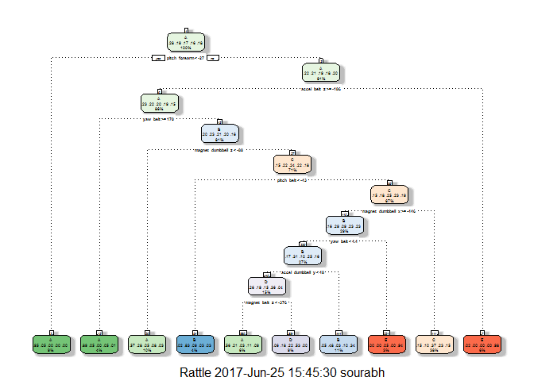

# Practical Machine Learning - Prediction Assignment Writeup
Sharmistha Chakrabarti  
June 19, 2017  


## BACKGROUND

Using devices such as *Jawbone Up, Nike FuelBand,* and *Fitbit* it is now possible to collect a large amount of data about personal activity relatively inexpensively. These type of devices are part of the quantified self movement - a group of enthusiasts who take measurements about themselves regularly to improve their health, to find patterns in their behavior, or because they are tech geeks. One thing that people regularly do is quantify how much of a particular activity they do, but they rarely quantify how well they do it. 

In this project, the goal is to use data from accelerometers on the belt, forearm, arm, and dumbell of Six young health participants. They were asked to perform barbell lifts correctly and incorrectly in 5 different ways: exactly according to the specification (Class A), throwing the elbows to the front (Class B), lifting the dumbbell only halfway (Class C), lowering the dumbbell only halfway (Class D) and throwing the hips to the front (Class E). More information is available from the website here: http://groupware.les.inf.puc-rio.br/har (see the section on the Weight Lifting Exercise Dataset).

The training data consists of accelerometer data and a label identifying the quality of the activity the participant was doing, whereas the testing data consists of accelerometer data without the identifying label. Our goal is to predict the labels for the test set observations.

The code below is used for model evaluation and selection, estimating the out-of-sample error, and making predictions on the test set observations. 

## DATA PROCESSING

Let's load the necessary `R packages` and the training and test data sets.

### Data Loading


```r
## Load the required packages
library(caret); library(ggplot2); library(randomForest); library(rattle); library(rpart); library(rpart.plot)
```


```r
training <- read.csv("pml-training.csv", na.strings = c("NA", "#DIV/0!", ""), header = TRUE)
testing <- read.csv("pml-testing.csv", na.strings = c("NA", "#DIV/0!", ""), header = TRUE)
## dim(training); dim(testing)
```

The training dataset has 19622 observations and 160 variables, whereas the test dataset has 20 observations and 160 variables. The goal of the project is to predict the manner in which the six participants did the exercise. That is, we need to predict the `"classe"` variable in the training set. 

### Data Cleaning

An inititial look at the raw data indicates that some data cleaning is necessary. The number of variables would be reduced by 

* Removing the variables (predictors) with near zero variance.
* Removing the first seven columns (predictors) as these variables have little to no predicting power for the outcome `classe`.
* Deleting the columns (predictors) containing missing value.


```r
nzv <- nearZeroVar(training)
training <- training[, -nzv]
testing <- testing[, -nzv]

training <- training[ , -c(1:7)]
testing <- testing[ , -c(1:7)]

training <- training[ , colSums(is.na(training)) == 0]
testing <- testing[ , colSums(is.na(testing)) == 0]

## dim(training); dim(testing)
## names(training); names(testing)

## check if the column names training and testing sets are same: 
all.equal(names(training)[1:length(names(training))-1], names(testing)[1:length(names(testing))-1])
```

```
## [1] TRUE
```

The cleaned data sets `training` and `testing` have 52 variables each with names of first 51 variables same. The last variable of `training` and `testing` sets are `classe` and `problem_id`, respectively.

### Data Partitioning

The cleaned training set is partitioned into training set (for prediction) and validation set (for computing the out-of-sample errors).


```r
set.seed(12345)
inTrain <- createDataPartition(y=training$classe, p=0.7, list=FALSE)
train <- training[inTrain, ]
valid <- training[-inTrain, ]
##dim(train); dim(valid)
```

## MODEL EVALUATION AND SELECTION (PREDICTIVE ALGORITHMS)

In order to predict the outcome, the classification tree and random forest algorithms are implemented below:

#### *Classification Tree*

A 5-fold cross validation is used below using the `trainControl` function.


```r
modFit_rpart <- train(classe ~ ., data = train, method = "rpart", trControl = trainControl(method = "cv", number =5))
print(modFit_rpart)
```

```
## CART 
## 
## 13737 samples
##    51 predictor
##     5 classes: 'A', 'B', 'C', 'D', 'E' 
## 
## No pre-processing
## Resampling: Cross-Validated (5 fold) 
## Summary of sample sizes: 10989, 10990, 10990, 10989, 10990 
## Resampling results across tuning parameters:
## 
##   cp          Accuracy   Kappa    
##   0.02400570  0.5721779  0.4595773
##   0.03583901  0.4947871  0.3458533
##   0.03707659  0.3745491  0.1537168
## 
## Accuracy was used to select the optimal model using  the largest value.
## The final value used for the model was cp = 0.0240057.
```

```r
fancyRpartPlot(modFit_rpart$finalModel)
```

<!-- -->

```r
## Predicting the outcomes using the validation set
predict_rpart <- predict(modFit_rpart, valid)
## Using the confusion matrix to test the accuracy of the model (classification tree)
confusion_rpart <- confusionMatrix(predict_rpart, valid$classe); confusion_rpart
```

```
## Confusion Matrix and Statistics
## 
##           Reference
## Prediction    A    B    C    D    E
##          A 1283  289   54   87   64
##          B   35  491   39   60  222
##          C  310  254  816  523  326
##          D   31  105  105  294    7
##          E   15    0   12    0  463
## 
## Overall Statistics
##                                          
##                Accuracy : 0.5687         
##                  95% CI : (0.556, 0.5814)
##     No Information Rate : 0.2845         
##     P-Value [Acc > NIR] : < 2.2e-16      
##                                          
##                   Kappa : 0.454          
##  Mcnemar's Test P-Value : < 2.2e-16      
## 
## Statistics by Class:
## 
##                      Class: A Class: B Class: C Class: D Class: E
## Sensitivity            0.7664  0.43108   0.7953  0.30498  0.42791
## Specificity            0.8827  0.92499   0.7092  0.94960  0.99438
## Pos Pred Value         0.7220  0.57969   0.3661  0.54244  0.94490
## Neg Pred Value         0.9048  0.87138   0.9426  0.87460  0.88526
## Prevalence             0.2845  0.19354   0.1743  0.16381  0.18386
## Detection Rate         0.2180  0.08343   0.1387  0.04996  0.07867
## Detection Prevalence   0.3020  0.14393   0.3788  0.09210  0.08326
## Balanced Accuracy      0.8246  0.67803   0.7523  0.62729  0.71114
```

From the above `Confusion Matrix and Statistics`, the accuracy rate of the model is 56.9%. So, the out-of-sample error rate is about 43.1%. As it turns out that the classification tree model is not predicting the outcome `classe` too well. Let's implement random forest algorithm and see if it improves the accuracy rate of prediction and reduces the out-of-sample error rate.

#### *Random Forest*


```r
modFit_rf <- train(classe ~ ., data = train, method = "rf", trControl = trainControl(method = "cv", number = 5))
print(modFit_rf)
```

```
## Random Forest 
## 
## 13737 samples
##    51 predictor
##     5 classes: 'A', 'B', 'C', 'D', 'E' 
## 
## No pre-processing
## Resampling: Cross-Validated (5 fold) 
## Summary of sample sizes: 10989, 10990, 10989, 10990, 10990 
## Resampling results across tuning parameters:
## 
##   mtry  Accuracy   Kappa    
##    2    0.9911189  0.9887634
##   26    0.9908277  0.9883970
##   51    0.9863141  0.9826879
## 
## Accuracy was used to select the optimal model using  the largest value.
## The final value used for the model was mtry = 2.
```

```r
## Predicting the outcomes using the validation set
predict_rf <- predict(modFit_rf, valid)
## Using the confusion matrix to test the accuracy of the model (random forest)
confusion_rf <- confusionMatrix(predict_rf, valid$classe); confusion_rf
```

```
## Confusion Matrix and Statistics
## 
##           Reference
## Prediction    A    B    C    D    E
##          A 1673   12    0    0    0
##          B    1 1120   16    0    0
##          C    0    7 1007   23    1
##          D    0    0    3  940    3
##          E    0    0    0    1 1078
## 
## Overall Statistics
##                                           
##                Accuracy : 0.9886          
##                  95% CI : (0.9856, 0.9912)
##     No Information Rate : 0.2845          
##     P-Value [Acc > NIR] : < 2.2e-16       
##                                           
##                   Kappa : 0.9856          
##  Mcnemar's Test P-Value : NA              
## 
## Statistics by Class:
## 
##                      Class: A Class: B Class: C Class: D Class: E
## Sensitivity            0.9994   0.9833   0.9815   0.9751   0.9963
## Specificity            0.9972   0.9964   0.9936   0.9988   0.9998
## Pos Pred Value         0.9929   0.9850   0.9701   0.9937   0.9991
## Neg Pred Value         0.9998   0.9960   0.9961   0.9951   0.9992
## Prevalence             0.2845   0.1935   0.1743   0.1638   0.1839
## Detection Rate         0.2843   0.1903   0.1711   0.1597   0.1832
## Detection Prevalence   0.2863   0.1932   0.1764   0.1607   0.1833
## Balanced Accuracy      0.9983   0.9899   0.9876   0.9869   0.9980
```

The random forest prediction algorithm improved the accuracy rate (98.9%) of prediction significantly. This results in the out-of-sample error rate of 1.1%. This is an excellent result and so the random forest model is used to make predictions on the test data set. It is notable though that the computation time of the random forest algorithm was fairly long. 

## PREDICTION ON TESTING SET

The random forest predictive model `modFit_rf` is used below to predict the outcome of the `classe` variable for the 20 different test cases.


```r
pred_testing <- predict(modFit_rf, testing); pred_testing
```

```
##  [1] B A B A A E D B A A B C B A E E A B B B
## Levels: A B C D E
```
